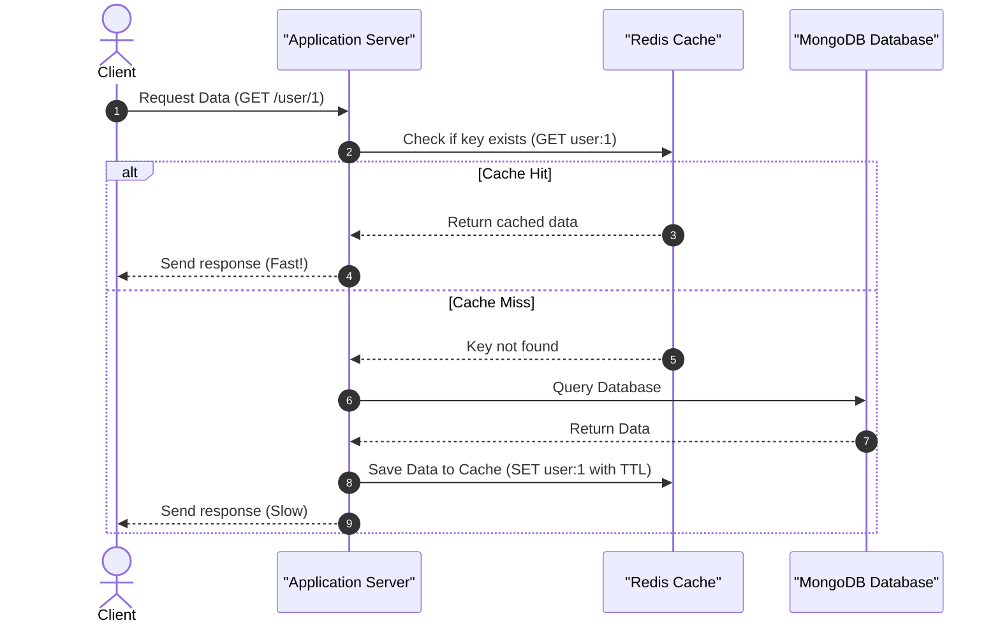
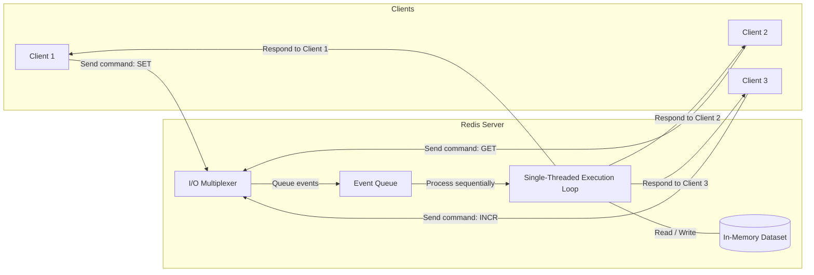
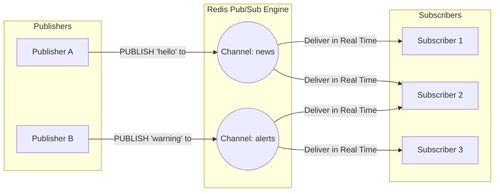
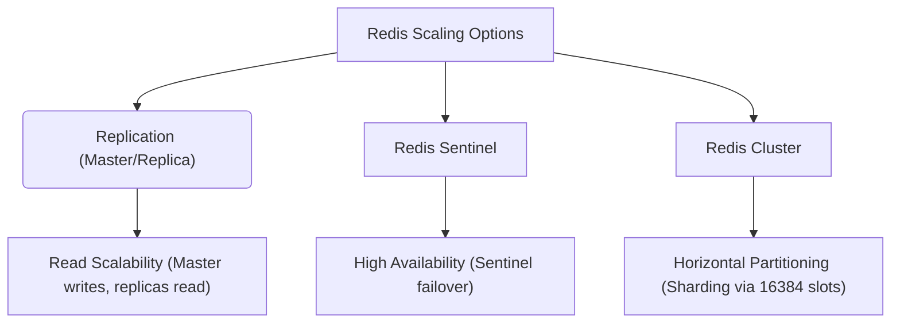

# Redis Foundation & Core Concepts

Welcome to the **Redis Foundation** learning repository. This guide provides comprehensive, structured notes covering core concepts, data structures, persistence strategies, high-availability architecture, and practical integration in Node.js.

---

## 📖 Table of Contents
1. [What is Redis?](#1-what-is-redis)
2. [Why Redis? (Key Characteristics)](#2-why-redis-key-characteristics)
3. [Redis Data Structures & Command Reference](#3-redis-data-structures--command-reference)
4. [Key Eviction & Memory Management](#4-key-eviction--memory-management)
5. [Persistence Mechanics: RDB vs. AOF](#5-persistence-mechanics-rdb-vs-aof)
6. [Transactions & Pipeling](#6-transactions--pipeling)
7. [Pub/Sub (Publish/Subscribe)](#7-pubsub-publishsubscribe)
8. [High Availability & Scaling (Replication, Sentinel, Cluster)](#8-high-availability--scaling-replication-sentinel-cluster)
9. [Local Integration: Node.js (ioredis) & MongoDB](#9-local-integration-nodejs-ioredis--mongodb)

---

## 1. What is Redis?
**Redis** (Remote Dictionary Server) is an open-source, in-memory, key-value data store. It is widely used as a database, cache, message broker, and streaming engine. Unlike traditional databases that store data on disk, Redis keeps all data in RAM, achieving sub-millisecond response times.

### Cache-Aside (Read-Through) Pattern Flow
This is the most common caching pattern used with Redis to speed up database queries:



---

## 2. Why Redis? (Key Characteristics)

- **In-Memory Speed**: Read/write operations are performed directly in memory, yielding up to hundreds of thousands of operations per second per core.
- **Single-Threaded Core**: Redis uses a single-threaded event loop (built on top of non-blocking multiplexing I/O) to process client requests. This design:
  - Eliminates thread-context switching overhead.
  - Guarantees command execution is **atomic** (no race conditions between concurrent commands).
  - *Note: Modern Redis uses background threads for certain operations like deleting large objects (lazy freeing) and writing to disk.*
- **Rich Data Types**: Unlike simple key-value stores that only support string keys and values, Redis supports native complex structures like lists, sets, hashes, and sorted sets.
- **Extensible**: Supports scripting via Lua (and Redis Functions in Redis 7+).

### Redis Single-Threaded Event Loop & Multiplexing Architecture


---

## 3. Redis Data Structures & Command Reference

Redis operates as a structured dictionary where keys are always strings (or binary safe sequences), but values can belong to several data types:

### A. Strings
The most basic Redis type. Ideal for caching sessions, HTML fragments, or simple key-value mappings. Max size is 512 MB.
*   **Commands**:
    *   `SET key value` - Set the value of a key.
    *   `GET key` - Get the value of a key.
    *   `EXPIRE key seconds` - Set a timeout on a key.
    *   `INCR key` / `DECR key` - Atomically increment/decrement integer values.
    *   `MSET` / `MGET` - Set/get multiple keys in a single roundtrip.

### B. Lists
Lists of strings sorted by insertion order. Implemented via linked lists, meaning inserting to the head or tail is $O(1)$. Good for queues (FIFO) or stacks (LIFO).
*   **Commands**:
    *   `LPUSH key value` / `RPUSH key value` - Insert value at head/tail.
    *   `LPOP key` / `RPOP key` - Remove and retrieve value from head/tail.
    *   `LRANGE key start stop` - Get a range of elements (e.g., `LRANGE mylist 0 -1` retrieves all).
    *   `LLEN key` - Get list length.

### C. Sets
Unordered collections of unique strings. Implemented via hash tables, making operations like checking existence $O(1)$. Useful for tracking unique visitors, tags, or social connections.
*   **Commands**:
    *   `SADD key member` - Add member to set.
    *   `SREM key member` - Remove member from set.
    *   `SISMEMBER key member` - Check if member exists (returns `1` or `0`).
    *   `SMEMBERS key` - Return all members.
    *   `SINTER key1 key2` / `SUNION key1 key2` / `SDIFF key1 key2` - Intersect, union, and difference of sets.

### D. Hashes
Maps between string fields and string values. Perfect for representing objects (e.g., a User profile).
*   **Commands**:
    *   `HSET key field value` - Set value of a hash field.
    *   `HGET key field` - Get value of a hash field.
    *   `HMSET` / `HMGET` - Set/get multiple hash fields.
    *   `HGETALL key` - Get all fields and values in a hash.
    *   `HDEL key field` - Delete a field from a hash.

### E. Sorted Sets (ZSets)
Non-repeating collections of strings where every member is associated with a floating-point **score**. Elements are kept sorted by their score. Uniquely suited for high-performance leaderboards, priority queues, and rate limiters.
*   **Commands**:
    *   `ZADD key score member` - Add/update member with score.
    *   `ZRANGE key start stop [WITHSCORES]` - Retrieve members sorted in ascending order.
    *   `ZREVRANGE key start stop [WITHSCORES]` - Retrieve members sorted in descending order.
    *   `ZREM key member` - Remove a member.
    *   `ZINCRBY key increment member` - Increment member score.

### F. Advanced Data Structures
*   **Bitmaps**: Treats strings as arrays of bits. Allows $O(1)$ bitwise operations. Ideal for high-density boolean tracking (e.g., daily active users).
*   **HyperLogLogs**: Probabilistic data structure used to estimate cardinality (unique item counts) of millions of items with a fixed memory footprint of 12 KB. Used for counting unique search queries or daily visitors.
*   **Geospatial (GEO)**: Stores coordinates (latitude/longitude) and calculates distances or searches within radius. Uses Sorted Sets internally.
*   **Streams**: Append-only log files modeled after Kafka. Supports consumer groups, message acknowledgment, and historical queries.

---

## 4. Key Eviction & Memory Management

Because Redis runs in RAM, managing memory limits is critical. When memory usage reaches the limit set by `maxmemory`, Redis applies an **eviction policy** configured in `redis.conf`:

| Policy | Description |
| :--- | :--- |
| `noeviction` | Returns errors when memory limit is reached (default). |
| `allkeys-lru` | Evicts the Least Recently Used (LRU) keys across all keys. |
| `volatile-lru` | Evicts LRU keys but only among keys with an expiration (`TTL`) set. |
| `allkeys-lfu` | Evicts the Least Frequently Used (LFU) keys across all keys. |
| `volatile-lfu` | Evicts LFU keys among keys with an expiration (`TTL`) set. |
| `allkeys-random` | Evicts keys randomly. |
| `volatile-random` | Evicts keys with `TTL` randomly. |
| `volatile-ttl` | Evicts keys with `TTL` that have the shortest remaining time-to-live. |

---

## 5. Persistence Mechanics: RDB vs. AOF

Redis offers two primary persistence strategies to write memory data onto non-volatile storage:

```mermaid
flowchart TD
    subgraph RDB_Snapshotting ["RDB Snapshotting"]
        R1["Write operations in memory"] --> R2["Interval Triggered (BGSAVE)"]
        R2 --> R3["Fork Child Process"]
        R3 --> R4["Write entire DB state to temp.rdb file"]
        R4 --> R5["Atomically replace dump.rdb"]
    end

    subgraph AOF_Log ["AOF Append-Only Log"]
        A1["Write operations in memory"] --> A2["Append command to AOF Buffer"]
        A2 --> A3["Fsync write to disk based on policy"]
        A3 -->|"Every second / Always"| A4["appendonly.aof File"]
    end
```



### A. RDB (Redis Database Backup)
*   **How it works**: Performs point-in-time compact snapshots of the dataset at specified intervals (e.g., every 5 minutes if 100 keys changed).
*   **Pros**:
    *   Very fast recovery for large datasets.
    *   Negligible runtime performance overhead since it forks a background child process to handle disk I/O.
*   **Cons**:
    *   Data loss risk: If Redis crashes between snapshots, any data written since the last snapshot is lost.
    *   Forks can cause brief latency spikes for massive datasets.

### B. AOF (Append Only File)
*   **How it works**: Logs every write command received by the server to an append-only file. Configurable write intervals (`fsync` options: `always`, `everysec` (recommended), or `no`).
*   **Pros**:
    *   Much more durable (typically less than a second of data loss).
    *   Human-readable log format.
*   **Cons**:
    *   AOF files are larger than RDB snapshots.
    *   Higher memory/CPU overhead due to frequent disk syncs.
*   **AOF Rewrite**: To prevent the file from growing indefinitely, Redis automatically runs a background rewrite process that recreates the AOF using the minimum number of commands needed to construct the current state.

> [!TIP]
> **Best Practice**: Use both! Combine RDB for fast crash recovery/backups and AOF for micro-durability.

---

## 6. Transactions & Pipelining

### Transactions
Redis transactions allow group execution of commands in a single atomic step using `MULTI`, `EXEC`, `DISCARD`, and `WATCH`.
*   All commands in a transaction are serialized and executed sequentially.
*   Redis transactions do **not** support rollback on runtime error (if one command fails, others still execute).
*   `WATCH` provides optimistic locking (transactions abort if watched keys change before execution).

```text
> MULTI
OK
> SET user:1:name "Alice"
QUEUED
> INCR user:1:visits
QUEUED
> EXEC
1) OK
2) (integer) 1
```

### Pipelining
Pipelining is a optimization technique where the client sends multiple commands to the server at once without waiting for the replies, then reads all replies in a single operation. This dramatically reduces network **RTT (Round Trip Time)**.

---

## 7. Pub/Sub (Publish/Subscribe)

Redis provides built-in Publish/Subscribe messaging channels:
*   **Publishers** send messages to channels without knowing who the subscribers are.
*   **Subscribers** express interest in one or more channels and receive messages in real time.
*   *Limitation*: Pub/Sub is fire-and-forget; it does not store history. If a subscriber is offline, they miss the message. Use **Redis Streams** if durability is required.

### Pub/Sub Message Broker Architecture


---

## 8. High Availability & Scaling

As architectures grow, a single Redis instance becomes a single point of failure. Redis handles scaling through:



1.  **Replication (Master-Replica)**:
    *   One master node acts as the write/read source.
    *   One or more replica nodes sync asynchronously with the master and serve read queries only.
    
    ```mermaid
    graph LR
        ClientWrites["Client Writes"] --> Master["Master Node (Writes & Reads)"]
        Master -->|"Asynchronous Replication"| Replica1["Replica Node 1 (Reads Only)"]
        Master -->|"Asynchronous Replication"| Replica2["Replica Node 2 (Reads Only)"]
        Replica1 --> ClientReads1["Client Reads"]
        Replica2 --> ClientReads2["Client Reads"]
    ```

2.  **Redis Sentinel**:
    *   A distributed monitoring system that runs alongside Redis.
    *   Monitors master and replica health.
    *   Automatically promotes a replica to master if the master goes offline (automatic failover).
3.  **Redis Cluster**:
    *   Distributes data across multiple master nodes automatically (sharding).
    *   Uses **16,384 hash slots** mapped to physical master nodes.
    *   Provides horizontal scalability and partition tolerance.

---

## 9. Local Integration: Node.js (ioredis) & MongoDB

This folder (`01_redis_foundation`) contains a minimal application integrating Node.js, Express, Redis (via `ioredis`), and MongoDB (via `mongoose`).

### Setup Overview
*   **`src/index.js`**: Connects to both Redis and MongoDB. Offers simple endpoints to test connections.
*   **`package.json`**: Configured as an ESM module (`"type": "module"`) running on `node src/index.js`.
*   **`api-test.rest`**: REST client file to trigger requests.

### Running Locally
To test the foundation setup locally, ensure you have running instances of Redis and MongoDB on your machine, then execute:

1.  **Install dependencies**:
    ```bash
    bun install
    # or
    npm install
    ```
2.  **Start the server**:
    ```bash
    npm run dev
    ```
3.  **Perform requests**:
    Use the `api-test.rest` file or run:
    ```bash
    curl http://localhost:3000/redis
    curl http://localhost:3000/mongo
    ```
