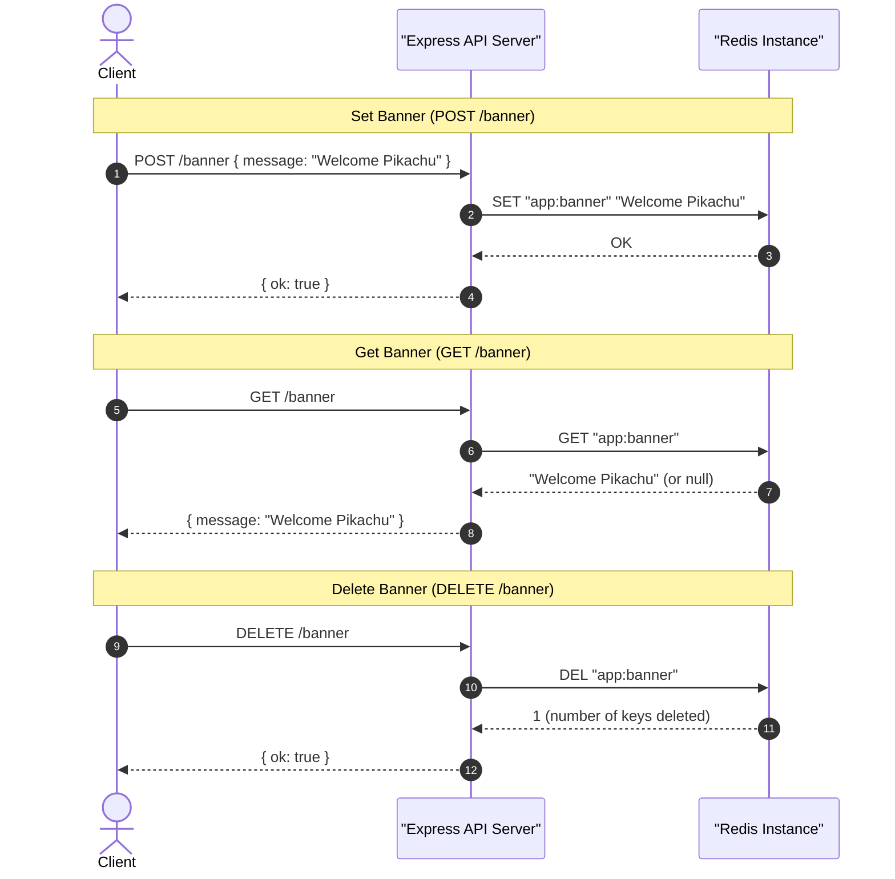

# Dynamic Site Banner Service (Redis Strings Example)

This sub-project demonstrates a real-world, high-performance use case for Redis **Strings**: managing a **Dynamic Site Banner** (such as an announcement or a marketing banner). 

Banners are read on almost every page load but updated infrequently. Storing them in Redis eliminates database lookups and minimizes latency for visitors.

---

## 📖 Table of Contents
1. [Architecture & Concept](#1-architecture--concept)
2. [Data Lifecycle & Flow Diagram](#2-data-lifecycle--flow-diagram)
3. [API Endpoints](#3-api-endpoints)
4. [Redis Commands Used](#4-redis-commands-used)
5. [Getting Started (Run & Test)](#5-getting-started-run--test)

---

## 1. Architecture & Concept

- **Key-Value Store**: The banner message is stored as a simple string under the key `"app:banner"`.
- **Write-Once, Read-Many (WORM)**: A store administrator updates the banner message once (via `POST /banner`), and millions of clients fetch it concurrently (via `GET /banner`).
- **Low Latency**: Since the text is fetched from memory, the page-load latency is close to zero milliseconds.
- **Express & ioredis**: The Node.js application uses the Express framework to expose HTTP endpoints and `ioredis` to manage the TCP connection pool to the Redis instance.

---

## 2. Data Lifecycle & Flow Diagram

Here is a visual representation of how the clients and the API server interact with the Redis instance:



---

## 3. API Endpoints

All endpoints are hosted at `http://localhost:3000`.

### A. Set Banner
*   **Method**: `POST`
*   **Path**: `/banner`
*   **Headers**: `Content-Type: application/json`
*   **Request Body**:
    ```json
    {
      "message": "Welcome Pikachu"
    }
    ```
*   **Response**: `{ "ok": true }`

### B. Get Banner
*   **Method**: `GET`
*   **Path**: `/banner`
*   **Response**: `{ "message": "Welcome Pikachu" }` (or `{ "message": null }` if deleted/empty)

### C. Delete Banner
*   **Method**: `DELETE`
*   **Path**: `/banner`
*   **Response**: `{ "ok": true }`

### D. Check if Banner Exists
*   **Method**: `GET`
*   **Path**: `/banner/exists`
*   **Response**: `{ "exists": true }` or `{ "exists": false }`

---

## 4. Redis Commands Used

*   **`SET`**: Used to save or overwrite the banner message string.
    ```text
    SET app:banner "Welcome Pikachu"
    ```
*   **`GET`**: Used to fetch the banner message string.
    ```text
    GET app:banner
    ```
*   **`DEL`**: Used to remove the banner key when clearing the announcement.
    ```text
    DEL app:banner
    ```
*   **`EXISTS`**: Used to verify if the key exists without loading the actual string value.
    ```text
    EXISTS app:banner
    ```

---

## 5. Getting Started (Run & Test)

Make sure you have a Redis server running locally on port `6379`.

### 1. Install Dependencies
```bash
bun install
# or
npm install
```

### 2. Start the Server
Runs with node's built-in file watcher:
```bash
npm run dev
```

### 3. Test Endpoints
You can use the built-in [api.rest](file:///e:/03_Dev_Playground/05_DevOps/Redis/02_site_banner/api.rest) file with the VS Code REST Client extension, or trigger them manually with `curl`:
```bash
# Create banner
curl -X POST http://localhost:3000/banner -H "Content-Type: application/json" -d '{"message": "Welcome Pikachu"}'

# Get banner
curl http://localhost:3000/banner

# Check exists
curl http://localhost:3000/banner/exists

# Delete banner
curl -X DELETE http://localhost:3000/banner
```
