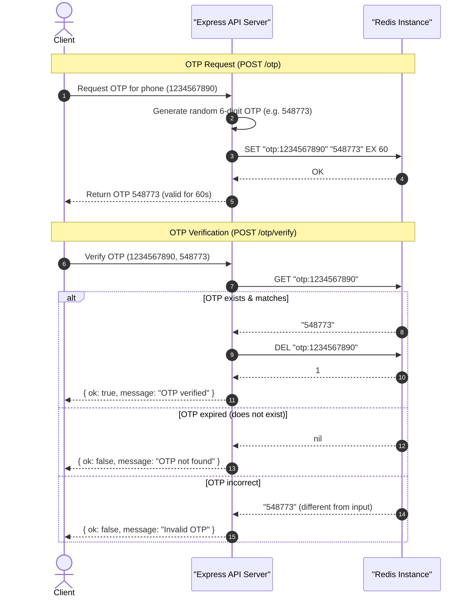

# OTP Login Verification Service (Redis TTL Example)

This sub-project demonstrates a highly practical use case for Redis **TTL (Time-To-Live)**: building a secure **One-Time Password (OTP)** login flow. 

Because OTPs are sensitive and temporary, they must expire automatically. Storing OTPs in a persistent database requires running cron-like cleanups, whereas Redis handles expiration automatically out-of-the-box in memory.

---

## 📖 Table of Contents
1. [Core Concepts: TTL & Key Expiration](#1-core-concepts-ttl--key-expiration)
2. [Workflow & Sequence Diagram](#2-workflow--sequence-diagram)
3. [API Endpoints](#3-api-endpoints)
4. [Redis Commands Used](#4-redis-commands-used)
5. [Getting Started (Run & Test)](#5-getting-started-run--test)

---

## 1. Core Concepts: TTL & Key Expiration

- **Time-to-Live (TTL)**: Redis allows you to attach an expiration timestamp to any key. When the countdown reaches zero, the key is automatically deleted from memory.
- **Single-Use Guard (Verification & Deletion)**: Once an OTP is verified successfully, it is immediately deleted (`DEL`) so it cannot be reused (preventing replay attacks).
- **In-Memory Volatility**: OTPs do not need long-term durability. Storing them in memory is much faster than saving them to a relational database.

---

## 2. Workflow & Sequence Diagram

Here is the step-by-step logic of requesting, verifying, and checking the remaining time on an OTP:



---

## 3. API Endpoints

All endpoints are hosted at `http://localhost:3000`.

### A. Request OTP
Generates a 6-digit OTP, stores it in Redis with a 60-second expiration, and returns it.
*   **Method**: `POST`
*   **Path**: `/otp`
*   **Request Body**:
    ```json
    {
      "phone": "1234567890"
    }
    ```
*   **Response**:
    ```json
    {
      "ok": true,
      "otp": "548773"
    }
    ```

### B. Verify OTP
Retrieves the OTP from Redis. If the OTP is correct, it deletes it instantly to prevent replay attacks.
*   **Method**: `POST`
*   **Path**: `/otp/verify`
*   **Request Body**:
    ```json
    {
      "phone": "1234567890",
      "otp": "548773"
    }
    ```
*   **Response (Success)**:
    ```json
    {
      "ok": true,
      "message": "OTP verified"
    }
    ```

### C. Get OTP TTL
Fetches the remaining lifetime (in seconds) of an OTP key.
*   **Method**: `GET`
*   **Path**: `/otp/:phone/ttl`
*   **Response**:
    ```json
    {
      "ttl": 42
    }
    ```
    *Note: Returns `-2` if the key has expired or does not exist.*

---

## 4. Redis Commands Used

*   **`SET key value EX seconds`**: Sets a key-value pair and registers an expiration time in seconds atomically.
    ```text
    SET otp:1234567890 "548773" EX 60
    ```
*   **`GET key`**: Retrieves the stored OTP string for comparison.
    ```text
    GET otp:1234567890
    ```
*   **`DEL key`**: Deletes the OTP immediately upon successful verification.
    ```text
    DEL otp:1234567890
    ```
*   **`TTL key`**: Checks the remaining time-to-live of the key.
    ```text
    TTL otp:1234567890
    ```

---

## 5. Getting Started (Run & Test)

### 1. Install Dependencies
```bash
bun install
# or
npm install
```

### 2. Start the Server
```bash
npm run dev
```

### 3. Test Endpoints
You can use the [api.rest](file:///e:/03_Dev_Playground/05_DevOps/Redis/03_login_otp_with_ttl/api.rest) file with the VS Code REST Client extension, or trigger them via `curl`:
```bash
# Request OTP
curl -X POST http://localhost:3000/otp -H "Content-Type: application/json" -d '{"phone": "1234567890"}'

# Get remaining TTL (replace phone as appropriate)
curl http://localhost:3000/otp/1234567890/ttl

# Verify OTP (replace code with the generated OTP from response)
curl -X POST http://localhost:3000/otp/verify -H "Content-Type: application/json" -d '{"phone": "1234567890", "otp": "548773"}'
```
