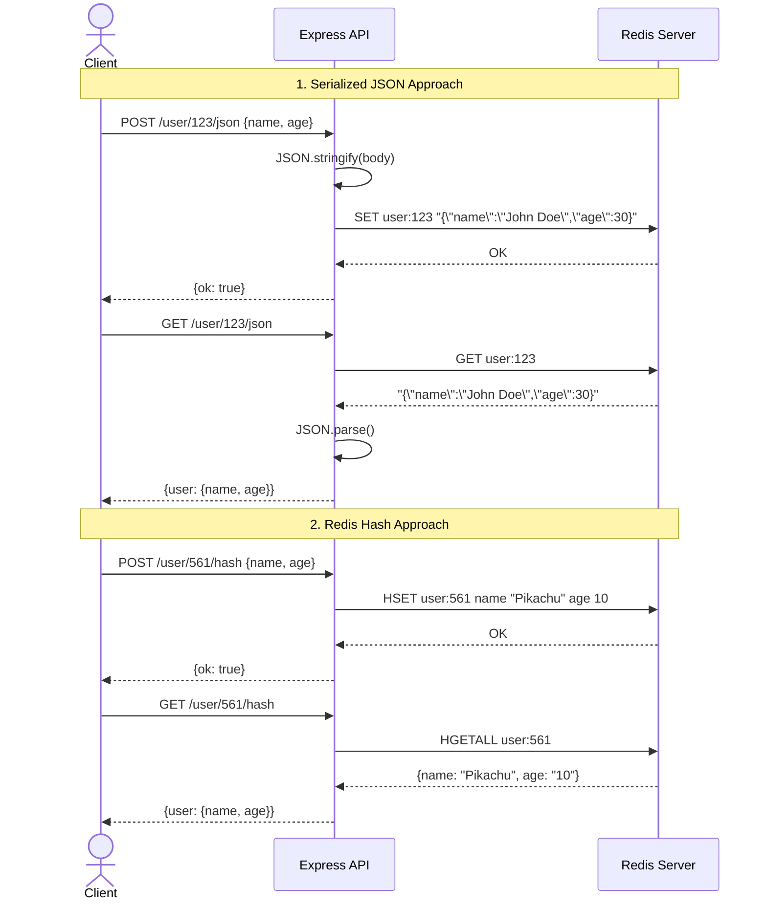

# Redis Study Notes: User Profile Storage Patterns

This project demonstrates two different ways to store and retrieve object data (like a User Profile) in Redis using Node.js, Express, and `ioredis`.

## Overview

When working with Redis, there are multiple data types you can use to store objects. This project explores two primary approaches:

1. **Serialized JSON Strings** (Using `SET` / `GET`)
2. **Redis Hashes** (Using `HSET` / `HGETALL`)

## Approaches

### 1. Serialized JSON Strings (`/user/:id/json`)
This approach takes the entire JSON payload, stringifies it, and stores it under a single Redis key using the generic `SET` command.

- **Pros:**
  - Simple to implement.
  - Useful if you always need to read or write the *entire* object at once.
- **Cons:**
  - You cannot update a single field without fetching the entire string, parsing it, modifying it, and saving it back.
  - Cannot query against specific fields inside the JSON easily (unless using RedisJSON module).

### 2. Redis Hashes (`/user/:id/hash`)
This approach maps the properties of the JSON object directly into a Redis Hash using `HSET`.

- **Pros:**
  - Memory efficient.
  - Allows you to read or update individual fields (e.g., using `HGET` or `HSET`) without loading the entire object.
- **Cons:**
  - Slightly more complex to work with deeply nested objects (Hashes are flat; nested objects would require flattening or stringifying the nested parts).

---

## API Endpoints

### Using JSON Strings
- **Create User:** `POST /user/:id/json` (Pass JSON body)
- **Get User:** `GET /user/:id/json`

### Using Redis Hashes
- **Create User:** `POST /user/:id/hash` (Pass JSON body)
- **Get User:** `GET /user/:id/hash`

---

## Data Flow Diagram



## Running the Project

1. Ensure a Redis server is running locally on port `6379`.
2. Install dependencies:
   ```bash
   npm install
   ```
3. Start the dev server (runs on `localhost:3000`):
   ```bash
   npm run dev
   ```
4. You can use the provided `api.rest` file with the REST Client extension in VS Code to test the endpoints.
