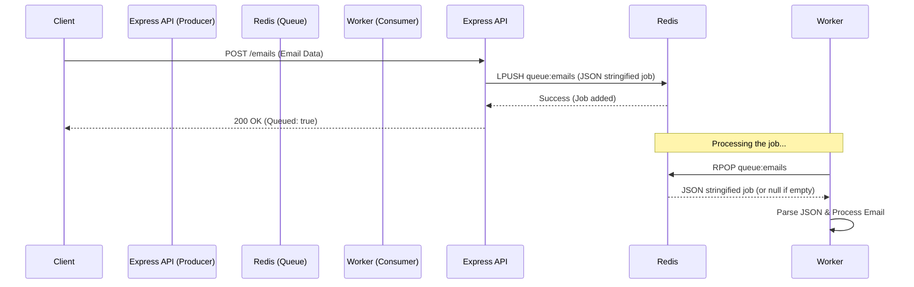
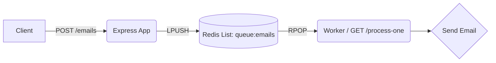

# Email Queue with Redis

This directory demonstrates how to build a simple task queue (specifically for emails) using **Node.js, Express, and Redis**. 

## 📝 Study Notes

A message queue allows us to decouple the receiving of requests from the processing of requests. This is especially useful for tasks that are slow or resource-intensive, like sending emails.

### Key Concepts
- **Producer**: The Express application that receives an HTTP request and adds the job to the queue.
- **Queue**: A Redis List data structure. We use `LPUSH` (Left Push) to add items to the queue and `RPOP` (Right Pop) to remove them. This creates a FIFO (First-In-First-Out) queue.
- **Consumer/Worker**: An endpoint (or separate background process) that picks up jobs from the queue and processes them.

### Dependencies Used
- `express`: For creating the REST API.
- `ioredis`: A robust, performance-focused Redis client for Node.js.

## 🏗️ Architecture Diagram

Here is the flow of how an email job gets queued and processed:



Component architecture:



## 🚀 How It Works

1. **Adding to the Queue (`POST /emails`)**:
   - The user sends a POST request with `to`, `subject`, and `body`.
   - The Express server creates a job object, stringifies it to JSON, and pushes it to the left side of the `queue:emails` Redis List using `redis.lpush()`.
   
2. **Processing the Queue (`GET /emails/process-one`)**:
   - When this endpoint is hit, it pops an item from the right side of the `queue:emails` List using `redis.rpop()`.
   - If the queue is empty, it returns `{ processed: false }`.
   - If a job exists, it parses the JSON and (in a real scenario) would process/send the email.

## 💻 Running the Project

1. Ensure you have **Redis** running locally (or update the `REDIS_URL` environment variable).
2. Install dependencies (you can use `npm` or `bun`):
   ```bash
   npm install
   # or
   bun install
   ```
3. Start the dev server:
   ```bash
   npm run dev
   ```
4. Test the API using the provided `api.rest` file (requires the REST Client extension in VS Code).
