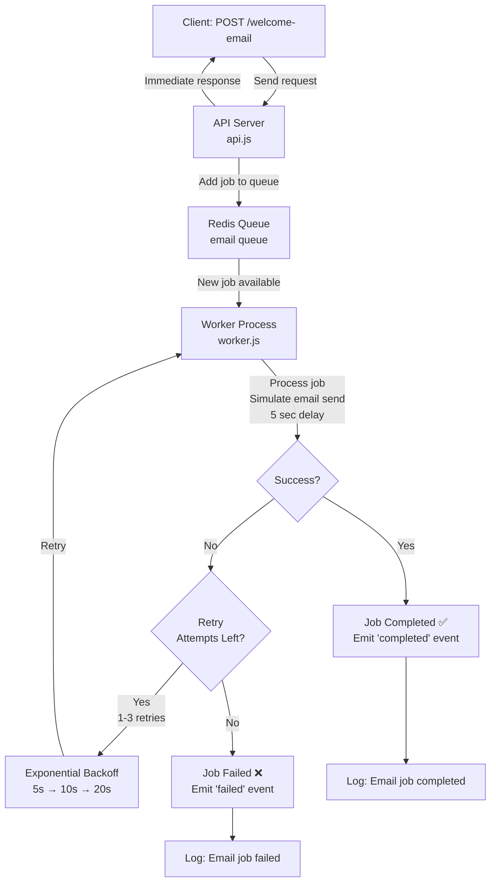

# 📧 Order Confirmation Jobs with BullMQ - Study Notes

## 🎯 What This Project Does

This is a **job queue system** that handles sending order confirmation emails asynchronously using **BullMQ** (a Redis-backed task queue). Instead of sending emails directly and blocking the API response, jobs are created and processed in the background by a worker.

---

## 📚 Core Concepts

### 1. **Job Queue Pattern**
Instead of:
```
User Request → Send Email → Response (slow ❌)
```

We use:
```
User Request → Create Job → Response (fast ✅) → Background Worker → Send Email
```

### 2. **BullMQ - What It Is**
- **BullMQ** = A Node.js library for creating **fast, reliable job queues** using Redis
- Replaces slower message brokers for many use cases
- Perfect for email sending, image processing, report generation, etc.

### 3. **Three Main Components**

| Component | Role | File |
|-----------|------|------|
| **Queue** | Creates & manages jobs | `queue.js` |
| **API** | Accepts requests & enqueues jobs | `api.js` |
| **Worker** | Processes jobs in background | `worker.js` |

---

## 🔍 Code Breakdown

### `queue.js` - The Job Queue Definition
```javascript
const emailQueue = new Queue("email", {
  connection: { host: "localhost", port: 6379 }
});
```

**What it does:**
- Creates a queue named `"email"` connected to Redis
- This queue will hold all pending email jobs
- Multiple workers can consume from this same queue

**Key Point:** The queue itself is just a definition - it doesn't process jobs. It just manages the job data in Redis.

---

### `api.js` - The Job Producer
```javascript
app.post("/welcome-email", async (req, res) => {
  const job = await emailQueue.add(
    "send-welcome-email",
    { to, subject, body },
    { attempts: 3, backoff: { type: "exponential", delay: 5000 } }
  );
  res.json({ job });
});
```

**What it does:**
1. **Receives** a POST request with email details
2. **Creates** a job in the queue with retry logic
3. **Returns** immediately (doesn't wait for email to send)

**Retry Configuration:**
- `attempts: 3` = Try 3 times if it fails
- `backoff: exponential` = Wait longer between retries
- `delay: 5000` = Start with 5 second delay, then 10s, then 20s, etc.

---

### `worker.js` - The Job Consumer
```javascript
const worker = new Worker("email", async (job) => {
  console.log("Processing job:", job.id);
  await new Promise(resolve => setTimeout(resolve, 5000)); // Simulate work
  console.log("Email sent!");
}, { connection });

worker.on("completed", (job) => { /* Handle success */ });
worker.on("failed", (job, err) => { /* Handle failure */ });
```

**What it does:**
1. **Watches** the `"email"` queue for new jobs
2. **Processes** each job (in this case, just sleeps for 5 seconds)
3. **Emits events** for success/failure handling

**Event Listeners:**
- `completed` = Job finished successfully
- `failed` = Job failed after all retry attempts

---

## 🔄 Complete Flow Diagram



---

## 🚀 How to Run

### Prerequisites
```bash
# 1. Make sure Redis is running (Docker)
docker run -p 6379:6379 redis:latest

# 2. Install dependencies
npm install
```

### Start the System
**Terminal 1 - Start the Worker (background job processor):**
```bash
node src/worker.js
```
You should see:
```
Worker listening for jobs...
```

**Terminal 2 - Start the API Server:**
```bash
npm run dev
# or: node --watch src/api.js
```
You should see:
```
Listening on port 3000
```

### Test It
**Using REST client or curl:**
```bash
curl -X POST http://localhost:3000/welcome-email \
  -H "Content-Type: application/json" \
  -d '{
    "to": "user@example.com",
    "subject": "Welcome!",
    "body": "Thanks for signing up"
  }'
```

**Response (immediate):**
```json
{
  "message": "Email job added",
  "job": {
    "id": 1,
    "name": "send-welcome-email",
    "data": { "to": "...", "subject": "...", "body": "..." }
  }
}
```

**In Terminal 1 (Worker), you'll see:**
```
Processing email job...... 1 send-welcome-email {...}
[5 seconds later...]
Email job completed!!!! 1 send-welcome-email {...}
```

---

## 📊 Key Architectural Patterns

### 1. **Producer-Consumer Pattern**
- **Producer** (API) = Creates work
- **Consumer** (Worker) = Completes work
- **Decoupled** = They don't talk directly, only through Redis

### 2. **Fire-and-Forget**
API doesn't wait for email to actually send. This is **critical for performance**:
- API responds in <10ms
- Email processing happens later
- User experience is fast ⚡

### 3. **Retry with Exponential Backoff**
```javascript
{
  attempts: 3,
  backoff: { type: "exponential", delay: 5000 }
}
```
- If job fails: retry after 5s
- Still failing: retry after 10s
- Still failing: retry after 20s
- This handles **temporary failures** (network blips, service down, etc.)

### 4. **Job Persistence**
- All jobs stored in **Redis** (in-memory database)
- If worker crashes, jobs are preserved
- When worker restarts, it continues processing

---

## 🐛 Common Issues & Solutions

### Issue: "Error connecting to Redis"
```
Error: connect ECONNREFUSED 127.0.0.1:6379
```
**Solution:** Make sure Redis is running
```bash
docker run -p 6379:6379 redis:latest
```

### Issue: Worker doesn't process jobs
**Solution:** Make sure both API and Worker are running in separate terminals

### Issue: Job stuck in "active" state
**Solution:** Worker crashed. Restart the worker to resume processing

### Issue: Email not actually sending
**Note:** This demo just simulates email (sleeps for 5 seconds). To send real emails:
```javascript
// Install email library
npm install nodemailer

// Use it in worker
import nodemailer from "nodemailer";
const transporter = nodemailer.createTransport({...});
await transporter.sendMail({ to: job.data.to, ... });
```

---

## 📈 Real-World Use Cases

| Use Case | Why Queue? |
|----------|-----------|
| **Email sending** | Don't block API waiting for SMTP |
| **Report generation** | Generate PDFs in background |
| **Image resizing** | CPU-intensive work, don't block API |
| **Webhook notifications** | Retry failed webhooks automatically |
| **Payment processing** | Handle 3rd party API latency |
| **Data aggregation** | Process large datasets slowly |

---

## 🧠 What You Learned

### Concepts
✅ Job queues (FIFO - First In First Out)  
✅ Producer-consumer pattern  
✅ Fire-and-forget pattern  
✅ Retry logic with exponential backoff  
✅ Event-driven architecture  
✅ Redis as a message broker  

### Skills
✅ Using BullMQ library  
✅ Connecting to Redis  
✅ Creating reliable background jobs  
✅ Handling failures gracefully  
✅ Scaling horizontally (multiple workers)  

---

## 🔗 Next Steps

1. **Add real email sending** using Nodemailer
2. **Add database** to track email delivery status
3. **Add dashboard** to visualize queue status (BullMQ Dashboard)
4. **Scale to multiple workers** on different servers
5. **Add job priority** (urgent emails first)
6. **Add scheduled jobs** (send at specific time)

---

## 📦 Dependencies Explained

```json
{
  "bullmq": "^5.4.2",      // Job queue library
  "express": "^4.18.3",    // Web framework for API
  "ioredis": "^5.4.1"      // Redis client
}
```

- **bullmq**: Handles all job queue logic
- **express**: Creates HTTP API endpoint
- **ioredis**: Communicates with Redis server

---

## 🎓 Study Summary Checklist

- [ ] Understand why queues are better than direct email sending
- [ ] Know the 3 components: Queue, API, Worker
- [ ] Understand Redis role (storage for jobs)
- [ ] Can explain retry logic
- [ ] Can start Redis, Worker, API in correct order
- [ ] Can make successful API request and see job processing
- [ ] Know difference between `attempts` and `backoff`
- [ ] Understand event listeners (`completed`, `failed`)

---

## 🚀 Quick Reference Commands

```bash
# Install Redis via Docker
docker run -p 6379:6379 redis:latest

# Install project dependencies
npm install

# Start worker (Terminal 1)
node src/worker.js

# Start API (Terminal 2)
npm run dev

# Test with REST client
POST http://localhost:3000/welcome-email
Content-Type: application/json

{ "to": "test@example.com" }
```

---

**Happy Learning! 🎉**
