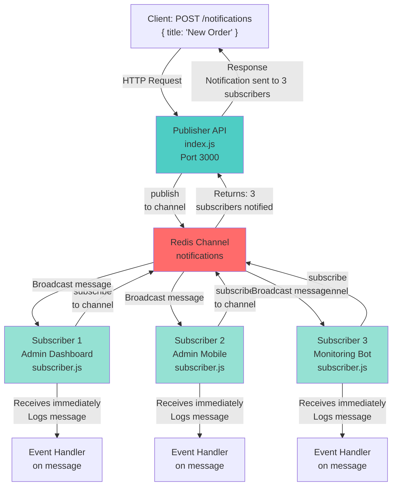

# 📢 Live Admin Notification Pub/Sub - Study Notes

## 🎯 What This Project Does

This is a **real-time notification system** using Redis **Pub/Sub (Publish/Subscribe)** pattern. The API publishes notifications to a Redis channel, and multiple subscribers listen for those messages and receive them instantly.

**Use Case:** Admin dashboard receives live notifications (new orders, user activity, system alerts, etc.) in real-time.

---

## 📚 Core Concepts

### 1. **Pub/Sub Pattern (Publish/Subscribe)**

This is **fundamentally different** from the job queue in the previous project:

| Aspect | Job Queue (BullMQ) | Pub/Sub |
|--------|-----|---------|
| **Persistence** | ✅ Jobs stored in Redis | ❌ Messages NOT stored |
| **Late Subscribers** | Get old jobs | ❌ Miss messages sent before subscription |
| **Delivery** | Guaranteed (retries) | ✅ Instant (fire-and-forget) |
| **Use Case** | Background jobs | Real-time notifications |
| **Example** | Email sending | Live chat, stock prices, admin alerts |

### 2. **How Pub/Sub Works**

```
Publisher (API Server)
    ↓
    Publish message to "notifications" channel
    ↓
Redis (In-memory broker)
    ↓
Subscriber 1 ← Subscriber 2 ← Subscriber 3
(Admin 1)      (Admin 2)      (Admin 3)
```

**Key Point:** The publisher doesn't know or care who is listening. It just broadcasts the message to the channel.

### 3. **Redis as a Message Broker**

- **Channel Name:** `"notifications"` (you can have multiple channels)
- **Message Format:** String (in this case, JSON)
- **Subscribers:** Listen on that channel continuously
- **Publishers:** Send messages whenever needed

---

## 🔍 Code Breakdown

### `index.js` - The Publisher (API Server)

```javascript
const publisher = new Redis("redis://localhost:6379");

app.post("/notifications", async (req, res) => {
  const payload = {
    title: req.body.title || "Feedback",
    createdAt: new Date().toISOString(),
  };

  const receiver = await publisher.publish(
    "notifications",
    JSON.stringify(payload),
  );

  res.json({ message: `Notification sent to ${receiver} subscribers` });
});
```

**What it does:**
1. **Creates** a Redis publisher client
2. **Listens** on `POST /notifications` endpoint
3. **Publishes** the message to the `"notifications"` channel
4. **Returns** how many subscribers received the message

**Key Details:**
- `publisher.publish(channel, message)` sends to all current subscribers
- `receiver` = number of subscribers that got this message
- Returns immediately (doesn't wait for processing)

### `subscriber.js` - The Subscriber (Listener)

```javascript
const subscriber = new Redis("redis://localhost:6379");

subscriber.subscribe("notifications", (err) => {
  if(err) {
    console.error('Failed to subscribe:', err.message);
  }
  console.log("Subscribed to notifications channel");
});

subscriber.on("message", (channel, message) => {
  console.log("Received on", channel, ":", JSON.parse(message));
});
```

**What it does:**
1. **Creates** a Redis subscriber client
2. **Subscribes** to the `"notifications"` channel
3. **Listens** for incoming messages using the `"message"` event
4. **Logs** the message when it arrives

**Key Details:**
- `subscriber.subscribe()` blocks the client for subscriptions only
- `on("message")` fires every time a message is published
- Stays connected and listening forever

---

## 🔄 Complete Flow Diagram



---

## 🚀 How to Run

### Prerequisites
```bash
# 1. Make sure Redis is running (Docker)
docker run -p 6379:6379 redis:latest

# 2. Install dependencies
npm install
```

### Start the System

**Terminal 1 - Start Subscriber 1:**
```bash
node src/subscriber.js
```
You should see:
```
Subscribed to notifications channel
```

**Terminal 2 - Start Subscriber 2 (optional, to see broadcasting):**
```bash
node src/subscriber.js
```
You should see:
```
Subscribed to notifications channel
```

**Terminal 3 - Start the Publisher API:**
```bash
npm run dev
# or: node --watch src/index.js
```
You should see:
```
Listening on port 3000
```

### Test It

**Send a notification:**
```bash
curl -X POST http://localhost:3000/notifications \
  -H "Content-Type: application/json" \
  -d '{ "title": "New Admin Alert!" }'
```

**API Response (immediate):**
```json
{
  "message": "Notification sent to 2 subscribers"
}
```

**In Terminal 1 & 2 (Subscribers), you'll see:**
```
Received on  notifications : {
  title: 'New Admin Alert!',
  createdAt: '2026-05-30T12:34:56.789Z'
}
```

**Key Observation:** Both subscribers receive the message **instantly** ⚡

---

## 🎯 Pub/Sub vs Job Queue Comparison

### When to Use Pub/Sub (This Project)

```javascript
✅ Real-time notifications
✅ Live updates (stock prices, sports scores)
✅ Chat messages
✅ Dashboard updates
✅ Admin alerts
✅ Broadcasting to multiple clients
```

**Why?** Because you need instant delivery to whoever is listening RIGHT NOW.

### When to Use Job Queue (Previous Project)

```javascript
✅ Email sending
✅ Report generation
✅ Image resizing
✅ Scheduled tasks
✅ Heavy processing
✅ Guaranteed delivery (with retries)
```

**Why?** Because you need the work done eventually, even if the job fails.

---

## 🔌 Redis Pub/Sub Architecture

```
┌─────────────────────────────────────────────────────────────┐
│                    Redis Server                              │
├─────────────────────────────────────────────────────────────┤
│  Channel: "notifications"                                    │
│  ├─ Subscriber 1 connection                                  │
│  ├─ Subscriber 2 connection                                  │
│  ├─ Subscriber 3 connection                                  │
│  └─ (No persistent queue - messages not stored)              │
└─────────────────────────────────────────────────────────────┘
         ↑                               ↓
      Publish                         Broadcast
      (API)                       (All subscribers)
```

**Critical Difference:** There is NO message queue. Messages are sent in-memory directly to connected subscribers.

---

## 🐛 Common Issues & Solutions

### Issue: "Failed to subscribe"
```
Error: connect ECONNREFUSED 127.0.0.1:6379
```
**Solution:** Make sure Redis is running
```bash
docker run -p 6379:6379 redis:latest
```

### Issue: Subscriber doesn't receive messages
**Cause:** Subscriber wasn't connected before the publish  
**Solution:** Start all subscribers BEFORE sending messages (they miss messages sent before subscription)

### Issue: Want to send messages to late subscribers?
**Solution:** Don't use Pub/Sub. Use:
- **Job Queue** (BullMQ) - messages are stored
- **Message Queue** (RabbitMQ) - messages are queued
- **Database** - check for unread notifications on login

---

## 💡 Real-World Examples

### Example 1: Live Admin Dashboard
```javascript
// Admin A subscribes
node subscriber.js  // Terminal 1

// Admin B subscribes  
node subscriber.js  // Terminal 2

// New order comes in
curl -X POST http://localhost:3000/notifications \
  -d '{ "title": "Order #12345 received" }'

// Both admins see it immediately in their dashboards
```

### Example 2: Multiple Channels
```javascript
// Subscribe to different channels
subscriber.subscribe("orders");
subscriber.subscribe("payments");
subscriber.subscribe("alerts");

// Publish to specific channels
publisher.publish("orders", "New order #123");
publisher.publish("payments", "Payment received $99");
publisher.publish("alerts", "CPU usage high");

// Each channel has its own subscribers
```

---

## 📊 Message Flow Timeline

```
T=0ms   → Client sends POST /notifications
T=1ms   → API publishes message to Redis
T=2ms   → Subscriber 1 receives message
T=2ms   → Subscriber 2 receives message
T=2ms   → Subscriber 3 receives message
T=3ms   → API returns response to client

Total latency: ~3ms
(Vs 5000+ms for async job processing)
```

---

## 🧠 What You Learned

### Concepts
✅ Pub/Sub pattern (Publish/Subscribe)  
✅ Broadcasting to multiple clients  
✅ Fire-and-forget messaging  
✅ Redis channels  
✅ Message subscriptions  
✅ Real-time systems  
✅ Difference from job queues  

### Skills
✅ Using Redis Pub/Sub  
✅ Creating publisher and subscriber clients  
✅ Publishing messages to channels  
✅ Subscribing to channels  
✅ Handling message events  
✅ Building real-time features  

---

## 🔗 Next Steps

1. **Add multiple channels** (orders, payments, alerts)
2. **Add pattern subscriptions** (e.g., `"notifications:*"`)
3. **Add message filtering** (only urgent notifications)
4. **Persist to database** for late subscribers
5. **Add Web Sockets** for browser real-time updates
6. **Scale to multiple servers** with Redis Pub/Sub
7. **Add Redis Streams** for message history

---

## 📚 Pub/Sub vs Streams vs Job Queues

| Feature | Pub/Sub | Streams | Job Queue |
|---------|---------|---------|-----------|
| Real-time? | ✅ Yes | ✅ Yes | ❌ No |
| Persistent? | ❌ No | ✅ Yes | ✅ Yes |
| Late subscribers? | ❌ Miss old | ✅ Can read history | ✅ Get all jobs |
| Best for | Notifications | Event log | Background work |
| Latency | <10ms | <100ms | Seconds |

---

## 🎓 Study Checklist

- [ ] Understand Pub/Sub pattern vs Job Queues
- [ ] Know publisher publishes, subscribers listen
- [ ] Understand Redis channels
- [ ] Know that messages are NOT stored (fire-and-forget)
- [ ] Can start subscriber before publisher
- [ ] Can send notification and see all subscribers receive it
- [ ] Know how to structure JSON payloads
- [ ] Understand why late subscribers miss messages
- [ ] Can explain use cases for Pub/Sub
- [ ] Can run Redis, Publisher, and Subscribers correctly

---

## 📦 Dependencies Explained

```json
{
  "express": "^4.18.3",    // Web framework for API
  "ioredis": "^5.4.1"      // Redis client (publisher & subscriber)
}
```

- **express**: Creates the HTTP API endpoint
- **ioredis**: Handles both publishing and subscribing to Redis

---

## 🚀 Quick Reference Commands

```bash
# Install Redis
docker run -p 6379:6379 redis:latest

# Install dependencies
npm install

# Terminal 1: Start Subscriber
node src/subscriber.js

# Terminal 2: Start Subscriber (optional)
node src/subscriber.js

# Terminal 3: Start API Publisher
npm run dev

# Send notification
curl -X POST http://localhost:3000/notifications \
  -H "Content-Type: application/json" \
  -d '{ "title": "Hello World" }'
```

---

## 🌟 Key Takeaway

**Pub/Sub = Broadcasting to whoever is listening RIGHT NOW**

Perfect for:
- Real-time dashboards ✅
- Live notifications ✅
- Chat applications ✅
- Live data feeds ✅

NOT suitable for:
- Long-running tasks ❌
- Guaranteed message delivery ❌
- Processing late-arriving subscribers ❌

---

**Happy Learning! 🎉**
