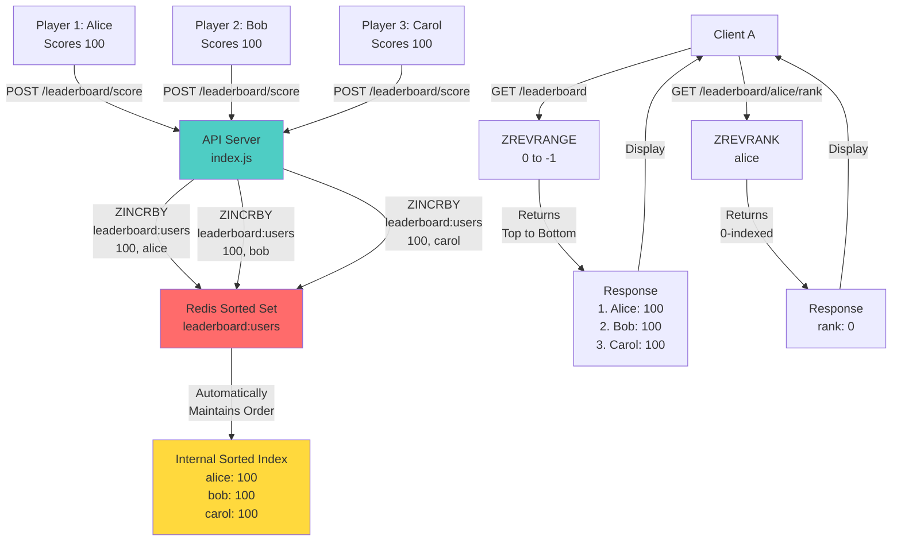

# 🏆 Leaderboard with Redis Sorted Sets - Study Notes

## 🎯 What This Project Does

This is a **real-time leaderboard system** that tracks player scores and rankings using Redis **Sorted Sets (ZSET)**. Perfect for:
- Gaming leaderboards (top scores)
- Competitive rankings
- Sales rankings
- User activity leaderboards

**Key Advantage:** Redis Sorted Sets automatically maintain order and provide instant rank lookups ⚡

---

## 📚 Core Concepts

### 1. **Redis Sorted Sets (ZSET)**

A sorted set is like a hybrid between a set and a list:

| Data Structure | Order | Speed | Use Case |
|---|---|---|---|
| **Set** | ❌ No | Fast | "Is user in set?" |
| **Sorted Set** | ✅ Yes (by score) | Fast | "What's the rank?" |
| **List** | ✅ Yes (by insertion) | Medium | "Get last 10 items" |

**Sorted Set = Set + Score (for ordering)**

### 2. **Leaderboard Logic**

A leaderboard needs:
```
User → Score → Rank
```

For example:
```
Alice  → 950  → Rank 1 (highest)
Bob    → 850  → Rank 2
Carol  → 750  → Rank 3
Dave   → 650  → Rank 4 (lowest)
```

**Redis handles this automatically!** You just:
1. Add/update scores
2. Ask for rankings
3. Redis maintains the sorted order

### 3. **Why Redis is Perfect for Leaderboards**

❌ **Database (SQL):**
```sql
SELECT * FROM users 
ORDER BY score DESC 
LIMIT 100;
-- Slow! Must scan all users and sort
```

✅ **Redis Sorted Set:**
```javascript
redis.zrevrange("leaderboard", 0, 99, "WITHSCORES");
// Fast! Already sorted, O(log N) complexity
```

---

## 🔍 Code Breakdown

### Key Redis Commands

#### 1️⃣ **ZINCRBY** - Add/Update Score
```javascript
app.post("/leaderboard/score", async (req, res) => {
  const { userId, score } = req.body;
  await redis.zincrby(LEADERBOARD_KEY, score, userId);
  res.json({ ok: true });
});
```

**What it does:**
- Adds `score` to the user's existing score
- If user doesn't exist, creates them with that score
- Automatically re-sorts the leaderboard

**Example:**
```bash
POST /leaderboard/score
{ "userId": "alice", "score": 100 }
→ Alice: 100

POST /leaderboard/score
{ "userId": "alice", "score": 50 }
→ Alice: 150 (100 + 50)
```

**Why "INCR"?** Perfect for streaming scores:
- Game sends score updates as they happen
- Each update increments the total
- Leaderboard stays current in real-time

---

#### 2️⃣ **ZREVRANGE** - Get Ranked Leaderboard
```javascript
app.get("/leaderboard", async (req, res) => {
  const leaderboard = await redis.zrevrange(
    LEADERBOARD_KEY,
    0,
    -1,
    "WITHSCORES",
  );
  res.json({ leaderboard });
});
```

**What it does:**
- `ZREVRANGE` = Get range in reverse order (highest first)
- `0, -1` = From position 0 to last (-1 means end)
- `WITHSCORES` = Include the score with each member

**Example Response:**
```json
{
  "leaderboard": [
    "alice", "150",
    "bob", "120",
    "carol", "90",
    "dave", "50"
  ]
}
```

**Alternative Commands:**
```javascript
// Get top 10
redis.zrevrange(LEADERBOARD_KEY, 0, 9, "WITHSCORES")

// Get top 100
redis.zrevrange(LEADERBOARD_KEY, 0, 99, "WITHSCORES")

// Get middle (positions 10-20)
redis.zrevrange(LEADERBOARD_KEY, 10, 20, "WITHSCORES")
```

---

#### 3️⃣ **ZREVRANK** - Get User Rank
```javascript
app.get("/leaderboard/:userId/rank", async (req, res) => {
  const rank = await redis.zrevrank(LEADERBOARD_KEY, req.params.userId);
  res.json({ rank });
});
```

**What it does:**
- Returns the rank of a specific user
- Ranks are 0-indexed (rank 0 = first place)
- Reverse order (highest scores = lower rank numbers)

**Example:**
```bash
GET /leaderboard/alice/rank
→ { "rank": 0 }  (Alice is #1)

GET /leaderboard/bob/rank
→ { "rank": 1 }  (Bob is #2)

GET /leaderboard/carol/rank
→ { "rank": 2 }  (Carol is #3)
```

**Key Insight:** O(1) complexity! Instant lookup, no scanning needed.

---

## 🔄 Complete Flow Diagram



---

## 🚀 How to Run

### Prerequisites
```bash
# 1. Make sure Redis is running (Docker)
docker run -p 6379:6379 redis:latest

# 2. Install dependencies
npm install
```

### Start the API
```bash
npm run dev
# or: node --watch src/index.js
```
You should see:
```
Listening on port 3000
```

### Test It

**Add some scores:**
```bash
# Alice scores 100
curl -X POST http://localhost:3000/leaderboard/score \
  -H "Content-Type: application/json" \
  -d '{ "userId": "alice", "score": 100 }'

# Bob scores 150
curl -X POST http://localhost:3000/leaderboard/score \
  -H "Content-Type: application/json" \
  -d '{ "userId": "bob", "score": 150 }'

# Carol scores 120
curl -X POST http://localhost:3000/leaderboard/score \
  -H "Content-Type: application/json" \
  -d '{ "userId": "carol", "score": 120 }'

# Alice scores 50 more (now 150)
curl -X POST http://localhost:3000/leaderboard/score \
  -H "Content-Type: application/json" \
  -d '{ "userId": "alice", "score": 50 }'
```

**Get the full leaderboard:**
```bash
curl http://localhost:3000/leaderboard
```
Response:
```json
{
  "leaderboard": [
    "alice", "150",
    "bob", "150",
    "carol", "120"
  ]
}
```

**Get a specific user's rank:**
```bash
curl http://localhost:3000/leaderboard/alice/rank
```
Response:
```json
{
  "rank": 0
}
```

---

## 📊 Redis Sorted Set Internal Structure

```
┌─────────────────────────────────────────────────────┐
│ ZSET: "leaderboard:users"                           │
├─────────────────────────────────────────────────────┤
│  Member    │ Score │ Rank (ZREVRANK) │ Percentile  │
├─────────────────────────────────────────────────────┤
│  alice     │  150  │      0          │  Top 25%    │
│  bob       │  150  │      1          │  Top 25%    │
│  carol     │  120  │      2          │  Top 25%    │
│  dave      │   90  │      3          │  Bottom 25% │
└─────────────────────────────────────────────────────┘
```

**Key Features:**
- **Automatically sorted** by score (highest first when using ZREVRANGE)
- **No duplicates** - one score per member
- **Updates are instant** - no need to re-sort entire leaderboard
- **O(log N) complexity** for all operations

---

## 💡 Real-World Use Cases

### 1. Gaming Leaderboard
```javascript
// Player completes level, gets 500 points
POST /leaderboard/score
{ "userId": "player_123", "score": 500 }

// Leaderboard updated instantly
GET /leaderboard → Shows all players ranked by total score
```

### 2. Sales Leaderboard
```javascript
// Rep completes sale
POST /leaderboard/score
{ "userId": "rep_john", "score": 5000 }

// Monthly leaderboard
GET /leaderboard → Top performers this month
```

### 3. Streaming Scores
```javascript
// As game progresses, send updates
score += 10 → POST /leaderboard/score { userId, score: 10 }
score += 25 → POST /leaderboard/score { userId, score: 25 }
score += 15 → POST /leaderboard/score { userId, score: 15 }

// Total automatically accumulated
```

---

## 🔐 Advanced Redis Sorted Set Features

### Get Score (Not Just Rank)
```javascript
const score = await redis.zscore(LEADERBOARD_KEY, "alice");
console.log(score); // "150"
```

### Get Range with Scores
```javascript
// Top 10
const top10 = await redis.zrevrange(
  LEADERBOARD_KEY, 
  0, 9, 
  "WITHSCORES"
);
```

### Get Rank by Score Range
```javascript
// Find all users with score between 100-200
const users = await redis.zrangebyscore(
  LEADERBOARD_KEY,
  100,
  200,
  "WITHSCORES"
);
```

### Remove User
```javascript
await redis.zrem(LEADERBOARD_KEY, "dave");
```

### Count Users
```javascript
const total = await redis.zcard(LEADERBOARD_KEY);
console.log(total); // 3
```

---

## 🧮 Complexity Analysis

| Operation | Complexity | Time |
|-----------|-----------|------|
| `ZINCRBY` | O(log N) | <1ms |
| `ZREVRANGE` | O(log N + M) | <1ms |
| `ZREVRANK` | O(log N) | <1ms |
| `ZSCORE` | O(1) | <1μs |
| `ZCARD` | O(1) | <1μs |

**What this means:** Even with 1 million players, operations complete in <1ms! ✅

---

## 🐛 Common Issues & Solutions

### Issue: Leaderboard shows wrong order
**Cause:** Not using ZREVRANGE (you're using ZRANGE)  
**Solution:** Use `ZREVRANGE` for descending (highest first)

### Issue: Rank is 0-indexed but you want 1-indexed
**Solution:** Add 1 to the rank
```javascript
const rank = await redis.zrevrank(LEADERBOARD_KEY, userId);
res.json({ rank: rank + 1 }); // Now 1-indexed
```

### Issue: Multiple users with same score
**Solution:** Redis handles this correctly (maintains insertion order as tiebreaker)

### Issue: Want to store negative scores
**Solution:** Redis supports it! Just use negative numbers

---

## 📈 Performance Comparison

### Getting Top 100 with Different Technologies

**Database (SQL):**
```sql
SELECT user_id, score FROM users 
ORDER BY score DESC LIMIT 100;
-- Speed: ~100-500ms (depends on index)
```

**In-Memory List:**
```javascript
// Must sort 1M items every request
users.sort((a,b) => b.score - a.score).slice(0, 100)
-- Speed: ~200-1000ms
```

**Redis Sorted Set:**
```javascript
redis.zrevrange("leaderboard", 0, 99, "WITHSCORES")
-- Speed: <1ms ⚡
```

**1000x faster!**

---

## 🧠 What You Learned

### Concepts
✅ Redis Sorted Sets (ZSET)  
✅ Automatic ordering by score  
✅ Rank vs Score  
✅ Ascending vs Descending order  
✅ 0-indexed ranking  
✅ Fire-and-forget updates  

### Skills
✅ Using `ZINCRBY` to add scores  
✅ Using `ZREVRANGE` to get leaderboard  
✅ Using `ZREVRANK` to get user rank  
✅ Building real-time leaderboards  
✅ Scaling to millions of users  

### Performance Insights
✅ Redis is 1000x faster than databases for leaderboards  
✅ O(log N) complexity for all operations  
✅ Handles millions of users instantly  

---

## 📚 Redis Sorted Set vs Other Data Structures

| Task | Best Structure | Why |
|------|---|---|
| Leaderboard | **ZSET** | Built-in ordering by score |
| Recent messages | List | FIFO queue |
| Job queue | **List + Priority** | Pop from front |
| Cache | String | Simple key-value |
| User follows | Set | Fast membership checks |
| Multiple indexes | **ZSET** | Flexible sorting |

---

## 🚀 Quick Reference

```bash
# Install
npm install

# Run
npm run dev

# Add score
curl -X POST http://localhost:3000/leaderboard/score \
  -d '{"userId":"alice","score":100}'

# Get leaderboard
curl http://localhost:3000/leaderboard

# Get rank
curl http://localhost:3000/leaderboard/alice/rank
```

---

## 🌟 Key Takeaways

1. **Redis Sorted Sets** are purpose-built for leaderboards
2. **ZREVRANGE** gets the top performers (highest scores first)
3. **ZREVRANK** gets a player's rank instantly
4. **ZINCRBY** accumulates scores as they come in
5. **All operations are sub-millisecond** - instantly responsive
6. **Scales to millions of users** without performance degradation

---

**Happy Learning! 🎉**
