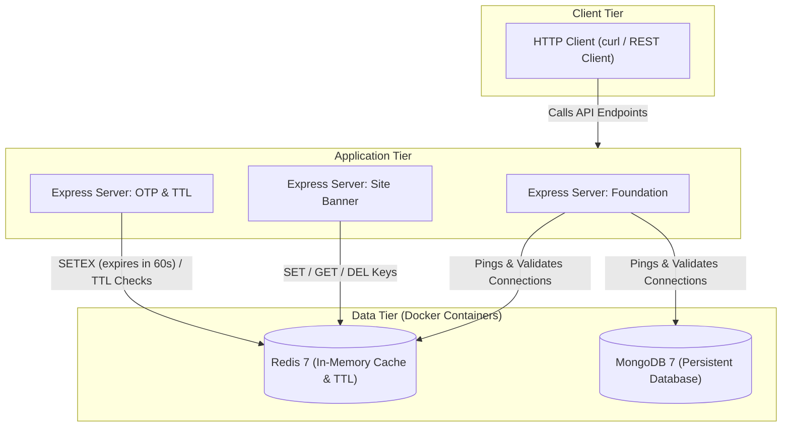

# 🔴 Redis Hands-On Learning Repository

Welcome to the ultimate learning lab for **Redis** and **DevOps**. This repository is a collection of focused, production-inspired Node.js microservices designed to explore, implement, and document essential Redis patterns—ranging from simple in-memory caching to token expiration and complex persistence mechanisms.

---

## 🏗️ System Architecture

This repository simulates a multi-tier local environment utilizing dockerized database systems and lightweight application containers:



---

## 🛠️ Technology Stack

| Technology | Purpose | Documentation / Source |
| :--- | :--- | :--- |
| **Redis 7 (Alpine)** | High-speed in-memory key-value data storage and cache | [Redis Official](https://redis.io/) |
| **MongoDB 7** | Persistent document database used in integration labs | [MongoDB Official](https://www.mongodb.com/) |
| **ioredis** | Feature-rich Redis client for Node.js | [ioredis GitHub](https://github.com/redis/ioredis) |
| **Express.js** | Minimalist web framework for HTTP services | [Express.js](https://expressjs.com/) |
| **Bun** | Ultra-fast JavaScript runtime, bundler, and package manager | [Bun.sh](https://bun.sh/) |
| **Docker Compose** | Streamlines orchestrating local Redis and MongoDB instances | [Docker Compose](https://docs.docker.com/compose/) |

---

## 📁 Repository Structure

Below is the directory tree of the workspace. Click any link to jump directly to the folders, scripts, or documentation:

```text
Redis/
├── 📄 docker-compose.yml          # Container configuration for Redis 7 & MongoDB 7
├── 📁 01_redis_foundation/        # Connectivity checks, PING commands, and Mongoose setup
│   ├── 📄 readme.md               # [Module 1 Documentation]
│   ├── 📁 src/
│   │   └── 📄 index.js            # Express app with Redis & Mongo ping endpoints
│   └── 📄 api-test.rest           # REST client verification requests
├── 📁 02_site_banner/             # CRUD Operations utilizing Redis Strings
│   ├── 📄 readme.md               # [Module 2 Documentation]
│   ├── 📁 src/
│   │   └── 📄 index.js            # Express routes to read, update, and delete banner
│   └── 📄 api.rest                # REST client verification requests
└── 📁 03_login_otp_with_ttl/      # OTP validation featuring automatic Time-To-Live expiration
    ├── 📄 readme.md               # [Module 3 Documentation]
    ├── 📁 src/
    │   └── 📄 index.js            # OTP generation and TTL inspection logic
    └── 📄 api.rest                # REST client verification requests
```
---

## 📚 Learning Modules & Explanations

### 01 • Redis Foundation & Connectivity
> **Concepts Covered**: Client instantiation (`ioredis`, `mongoose`), containerized architecture, health checks.

Sets up baseline connections. Exposes endpoints to confirm that both local in-memory (Redis) and persistent storage (MongoDB) are reachable:
*   `GET /redis`: Sends a `PING` command to the Redis server and returns the status.
*   `GET /mongo`: Executes a ping command inside MongoDB connection pool.
*   **Source Code**: [index.js](file:///e:/03_Dev_Playground/05_DevOps/Redis/01_redis_foundation/src/index.js)
*   **Module Guide**: [01_redis_foundation/readme.md](file:///e:/03_Dev_Playground/05_DevOps/Redis/01_redis_foundation/readme.md)

### 02 • Dynamic Site Banner (Redis Strings)
> **Concepts Covered**: Key-Value caching, String CRUD operations (`SET`, `GET`, `DEL`, `EXISTS`).

Illustrates how to store site-wide configurations that require sub-millisecond retrieval. By keeping the site announcement under key `app:banner`, we handle heavy home page reads effortlessly.
*   `POST /banner`: Sets the message.
*   `GET /banner`: Fetches the announcement (Cache read).
*   `DELETE /banner`: Removes the announcement.
*   `GET /banner/exists`: Inspects whether a banner is active.
*   **Source Code**: [index.js](file:///e:/03_Dev_Playground/05_DevOps/Redis/02_site_banner/src/index.js)
*   **Module Guide**: [02_site_banner/readme.md](file:///e:/03_Dev_Playground/05_DevOps/Redis/02_site_banner/readme.md)

### 03 • OTP Verification (Redis Time-to-Live)
> **Concepts Covered**: Volatile data management, auto-expiry (`SET key value EX seconds`), remaining life checks (`TTL`), prevention of replay attacks.

Simulates a secure phone OTP code verification system. Generated OTP codes are set to expire automatically in **60 seconds**, protecting users from code hijacks and automating storage cleanup.
*   `POST /otp`: Generates a random 6-digit code and stores it in Redis with `EX 60`.
*   `POST /otp/verify`: Verifies code correctness. If valid, deletes key immediately to prevent duplicate reuse.
*   `GET /otp/:phone/ttl`: Returns the remaining validation window.
*   **Source Code**: [index.js](file:///e:/03_Dev_Playground/05_DevOps/Redis/03_login_otp_with_ttl/src/index.js)
*   **Module Guide**: [03_login_otp_with_ttl/readme.md](file:///e:/03_Dev_Playground/05_DevOps/Redis/03_login_otp_with_ttl/readme.md)

---

## 🚀 Getting Started

### 1. Run the Infrastructure
Spin up the database engines in detached background mode using Docker Compose from the root workspace directory:
```bash
docker compose up -d
```
This runs:
- **Redis 7** on port `6379` (with Append-Only File `AOF` persistence turned on for durability).
- **MongoDB 7** on port `27017` (creating/connecting to database `chai_aur_redis`).

To monitor logs, run:
```bash
docker compose logs -f
```

### 2. Running a Project Module
Each module runs independently. Go to any module folder, install dependencies, and run the developer command:
```bash
cd 02_site_banner
bun install
# or npm install

npm run dev
```

### 3. Verify APIs
Test endpoints inside each project directory using their respective REST client `.rest` files or standard `curl` requests.
